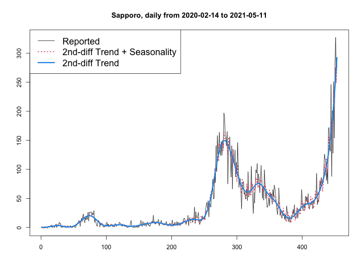

# R Package SapporoCovidMonitor
A simple RStan-based package for monitoring daily COVID-19 positive cases in Sapporo

## Overview



This package is forked from [TokyoCovidMonitor](https://github.com/ozt-ca/TokyoCovidMonitor) originally created by Takashi J Ozaki (@ozt-ca). Please refer to the [TokyoCovidMonitor](https://github.com/ozt-ca/TokyoCovidMonitor) repository for more details.

## Installation

```
devtools::install_github('kn1kn1/SapporoCovidMonitor')
```

## Walk through

If Sapporo city government announced that the number of reported positive cases today was 100, just run as below.

```
library(SapporoCovidMonitor)
out <- stanBstsFit(100)
val <- fitValue(out)
plotOutput(val, out)
```

If you want to see the past model on such as 2021-01-01, run as below.
```
out <- stanBstsFit(lastday = "2021-01-01")
```
